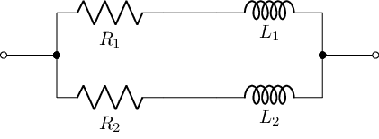
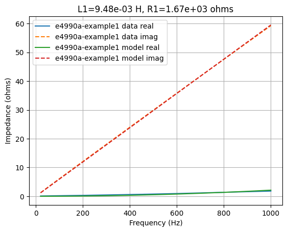
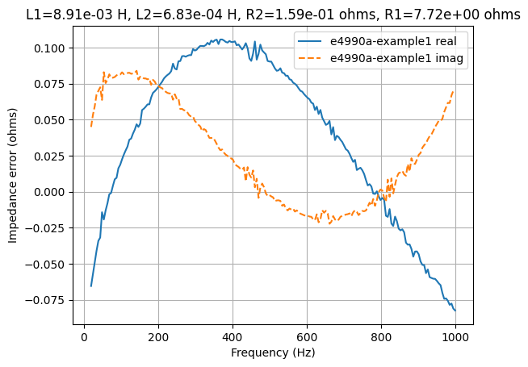
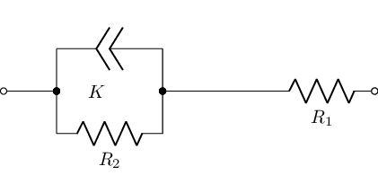
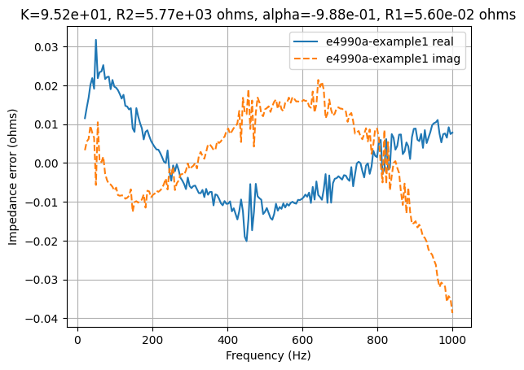
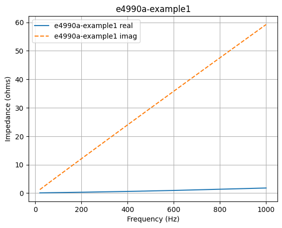

Introduction
============

This Python module is for fitting electrical models to measured impedance data.   It also includes a command-line program to assist with automated fitting.


Installation
============

The easiest way is using the command line command:

   $ pip install .


zfit
====

Here's an example of how model fitting can be performed using a Python script:

``` python
from zfitpy import zfit

net = "(CPE('K', 'alpha') | R('R2')) + R('R1')"
ranges = {'R1': (1e-3, 1e3), 'K': (1e-3, 1e3), 'alpha': (-1, 1), 'R2': (100, 1e4)}

data, fitmodel = zfit('E4990A-example1.csv', net, ranges, Ns=10)
print(fitmodel)
print(fitmodel.error)
```

Here `Ns` specifies the number of steps in each search range.  It can be explicitly defined for each search range, for example,

``` python
ranges = {'R1': (1e-3, 1e3, 10), 'K': (1e-3, 1e3, 20), 'alpha': (-1, 1), 'R2': (100, 1e4)}
```

The error between the measured data and best-fit model can be plotted using:

``` python
from zfitpy import Plotter
plotter = Plotter()
plotter.Z_error(data, fitmodel)
```

Note, a parameter names cannot be a substring of another parameter
name, i.e., 'R' cannot be used if there is a parameter 'R1'.

   
zfitpy
======

zfitpy is a command-line Python program.  It is designed for fitting
electrical models to impedance data.   For example:

``` bash
   $ zfitpy --net "L('L1') + (R('R1') | (L('L2') + R('R2')))" --ranges="{'R1':(0,5e3),'L1':(1e-3,20e-3),'R2':(0,0.1),'L2':(1e-3,20e-3)}" --input demo/E4990A-example1.csv --plot-error
```
   
The network is specified using Lcapy notation for networks.  This example uses a network comprised of a parallel combination of RL series networks.  The network can be drawn using:

``` bash
   $ zfitpy --net "L('L1') + (R('R1') | (L('L2') + R('R2')))" --draw
```




The network in this example has four parameters: `R1`, `L1`, `R2`, and
`L2`.  A brute force search is performed for each component using the
specified ranges; this is refined with a finishing search.  The ranges
are specified as a Python dictionary, keyed by component name, with
the range for each component specified as a tuple.  The number of
steps in each range is 20 can be altered with the `--steps` option.

The impedance of the data and model can be plotted using:

```
   $ zfitpy --plot-fit --net "L('L1') + (R('R1') | (L('L2') + R('R2')))" --ranges="{'R1':(0,5e3),'L1':(1e-3,20e-3),'R2':(0,0.1),'L2':(1e-3,20e-3)}" --input demo/E4990A-example1.csv
```
   


The impedance error between the data and model can be plotted using:

```
   $ zfitpy --plot-error --net "L('L1') + (R('R1') | (L('L2') + R('R2')))" --ranges="{'R1':(0,5e3),'L1':(1e-3,20e-3),'R2':(0,0.1),'L2':(1e-3,20e-3)}" --input demo/E4990A-example1.csv
```




Here's another network using a constant phase element (CPE).

``` bash
   $ zfitpy --net "(CPE('K', 'alpha') | R('R2')) + R('R1')" --draw
```




```
   $ zfitpy --plot-error --net "(CPE('K', 'alpha') | R('R2')) + R('R1')"  --ranges="{'R1':(0,1e3),'K':(1e-3,1e3),'alpha':(-1,1),'R2':(1e2,1e4)}" --input demo/E4990A-example1.csv
```




The data format for the plots depends on the extension.  matplotlib is
used for the plotting and so the pdf, png, pgf, and jpg formats are
all supported.   For example:

``` bash
   $ zfitpy --net "CPE('K', 'alpha')" --draw --output CPE.png
```

The data can be plotted without fitting if the `ranges` option is not specified.  For example:

``` bash
   $ zfitpy --plot-data --input demo/E4990A-example1.csv
```



A Nyquist plot is generated if the `--nyquist` option is specified.   Magnitude and phase is plotted is the `--magphase` option is specified.  The plot style can be altered using the `--style` option to specify a Matplotlib style file.

Other command line options for zfitpy can be found with the --help option.

Here's another example that loads the network and ranges from files.
It uses a Matplotlib style file and annotates the title with the
model, the optimization method, and the rms error.

``` bash
   $ zfitpy --net RL2.net --ranges=RL2.ranges --input data/data.csv --plot-error --method='brute' --title='%model, %method, %rmse' --style=z.mplstyle --output RL2-brute.pdf
```
