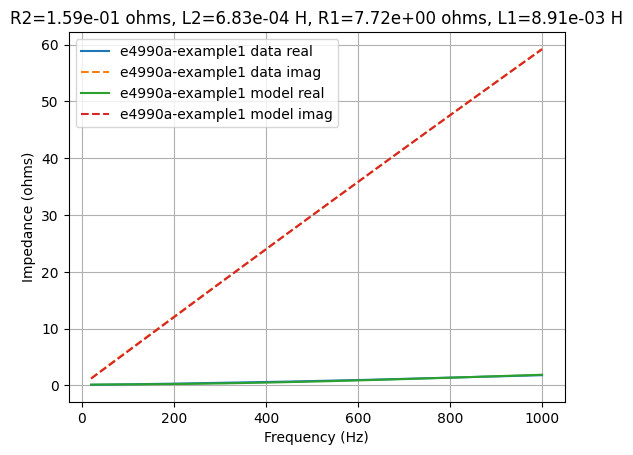

Introduction
============

This Python module is for fitting impedance data to electrical models.   It also includes a command-line program to assist with automated fitting.


Installation
============

The easiest way is using the command line command:

   $ pip install .
   
   
Zfitter
=======

Zfitter is a command-line Python program.  It is designed for fitting
electrical models to impedance data.   For example:

``` bash
   $ zfitter --net "L('L1') + (R('R1') | (L('L2') + R('R2')))" --ranges="{'R1':(0,5e3),'L1':(1e-3,20e-3),'R2':(0,0.1),'L2':(1e-3,20e-3)}" --input demo/E4990A-example1.csv --plot-error
```
   
The network is specified using Lcapy notation for networks.  This example uses a network comprised of a parallel combination of RL series networks.  The network can be drawn using:

``` bash
   $ zfitter --net "L('L1') + (R('R1') | (L('L2') + R('R2')))" --draw
```


The network in this example has four parameters: `R1`, `L1`, `R2`, and
`L2`.  A brute force search is performed for each component using the
specified ranges; this is refined with a finishing search.  The ranges
are specified as a Python dictionary, keyed by component name, with
the range for each component specified as a tuple.  The number of
steps in each range is 20 can be altered with the `--steps` argument.

The impedance of the data and model can be plotted using:

```
   $ zfitter --plot-fit --net "L('L1') + (R('R1') | (L('L2') + R('R2')))" --ranges="{'R1':(0,5e3),'L1':(1e-3,20e-3),'R2':(0,0.1),'L2':(1e-3,20e-3)}" --input demo/E4990A-example1.csv
```
   


The impedance error between the data and model can be plotted using:

```
   $ zfitter --plot-error --net "L('L1') + (R('R1') | (L('L2') + R('R2')))" --ranges="{'R1':(0,5e3),'L1':(1e-3,20e-3),'R2':(0,0.1),'L2':(1e-3,20e-3)}" --input demo/E4990A-example1.csv
```


Here's another network using a constant phase element (CPE).

``` bash
   $ zfitter --net "(CPE('K', 'alpha') | R('R2')) + R('R1')" --draw
```


```
   $ zfitter --plot-error --net "(CPE('K', 'alpha') | R('R2')) + R('R1')"  --ranges="{'R1':(0,1e3),'K':(1e-3,1e3),'alpha':(-1,1),'R2':(1e2,1e4)}" --input demo/E4990A-example1.csv
```


The command line options for zfitter can be found with the `--help` argument.


